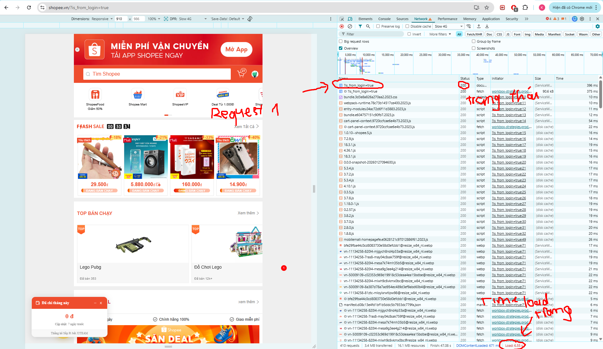
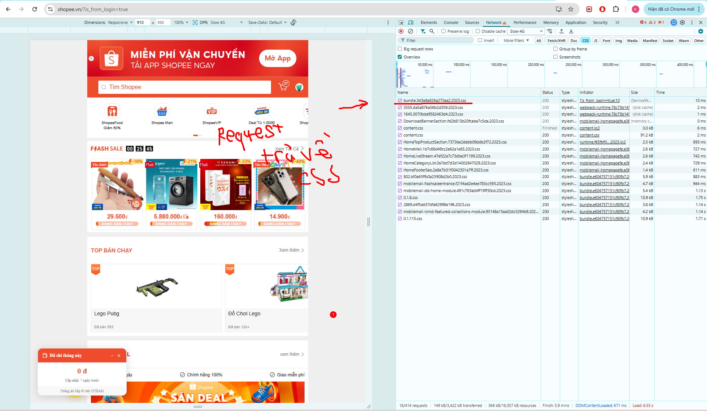

## Phần A

### Câu A1:

1. Các bước theo thử tự:
- Request xuất phát từ máy tính cá nhân đi qua router Wifi
- Đi qua nhà mạng và sau đó đi qua cáp quang biển ở biển Đông
- Request đến trụ sở của Shopee ở Singapore
- Server xử lý request của người dùng và trả về dữ liệu theo chiều ngược lại
- Browser người dùng nhận HTML, CSS, JS và render ra giao diện

2. Tab network trong DevTools cho biết các thông tin: Mọi tài nguyên được tải xuống hoặc gửi đi, trạng thái của từng request, kich thước của file tải về, thời gian mất bao lâu để tải file,... 



### Câu A2:
Các lỗi semantic:
- Sử dụng div cho các vùng chức năng chính: Thay vì dùng header, main và footer, đoạn code dùng div
- Thiếu thẻ điều hướng nav, Google không hiểu được các đường dẫn quan trọng để lập index
- Không dùng các thẻ tiêu đề h1-h6
- Thiếu thuộc tính alt trong thẻ img, hình ảnh không có mô tả văn bản, khiến Google không xem được ảnh
- Đoạn mã sửa lỗi:
```html
<header>
    <div class="logo">ShopTLU</div>
    <nav>
        <ul>
            <li><a href="/">Trang chủ</a></li>
            <li><a href="/products">Sản phẩm</a></li>
        </ul>
    </nav>
</header>

<main>
    <article class="product">
        <h1>iPhone 16 Pro</h1>
        <p class="price">25.990.000đ</p>
        <figure>
            
        </figure>
    </article>
</main>

<footer>
    <p>© 2026 ShopTLU</p>
</footer>
```

### Câu A3:
Hộp 1
TextATextB
Hộp 2
TextCTextD (TextD im đậm)
Hộp 3

### Câu A4:
1.  Sự khác nhau:
    - thead: table header, dùng để ghi tiêu đề các cột
    - tbody: table body, thân bảng chứa các dữ liệu chính
    - tfoot: table footer, thường dùng để ghi các hàng tổng cộng, tổng kết 
2. Không nên dùng table trong layout trang web bởi vì: 
    - Không mang tính semantic và ảnh hưởng đến SEO
    - Khó để thiết kế theo đúng như ý, tại các bảng khá cứng nhắc
    - Code không sạch và ảnh hưởng đến trải nghiệm người dùng

## Phần B

### Câu B3:
1. Sai khai báo DOCTYPE: `<!DOCTYPE>` thiếu chữ html (`<!DOCTYPE html`)

2. Thẻ title chưa đóng: `<title>Trang web` đang bị thiếu thẻ đóng ` </title> `

3. Sai giá trị charset: Thuộc tính `<meta charset="utf8">` thiếu dấu gạch ngang, sửa thành charset="UTF-8".

4. Thẻ `<h1>` đóng sai: `<h1>Welcome to ShopTLU<h1>`, sửa thành `</h1>` ở cuối

5. Thẻ `<a>` đóng sai: phần `<a href="home">Trang chủ<a>` thiếu dấu `/` ở thẻ đóng `</a>`.

6. Thẻ `` thiếu ngoặc kép: `src=iphone.jpg` đặt trong dấu ngoặc kép `src="iphone.jpg" `

7. Thẻ `` thiếu thuộc tính alt

8. Lỗi lồng thẻ: `<b>25.990.000đ</p></b>` sai thứ tự. Cần sửa thành `<b>25.990.000đ</b></p>`

9. Dùng nhiều thẻ `<main>`: Sửa `<main><p>Sidebar content</p></main>` đổi thành thẻ `<aside> `

10. Thẻ `<p>` ở footer chưa đóng: `<p>Copyright 2026 đang bị thiếu </p>`

11. Thiếu thẻ `</html>`: Dưới cùng của tài liệu chưa được chốt bằng thẻ đóng `</html>`

### Câu B4:
1. 3 thẻ semantic mà tiki.vn sử dụng: `<script>`, `<a>`, ``
- Thẻ không phải semantic: `<div>`

2. Trang không có table

3. Input types được dùng là aria-label


## Phần C

### Câu C2:
Thẻ `<div>` tuy dễ dùng và dễ làm quen cho người mới học nhưng về lâu dài, bỏ qua semantic HTML mà chỉ dùng mỗi thẻ `<div>` sẽ tạo ra không đẹp và ít có khả năng tùy biến.

Xét về SEO, các máy tìm kiếm như Google không đọc giao diện CSS mà đọc mã HTML để hiểu cấu trúc trang. Việc sử dụng các thẻ semantic như `<main>`, `<article>`, hay `<aside>` giúp Google xác định chính xác đâu là nội dung cốt lõi và đâu là thông tin phụ. Một trang web chỉ toàn thẻ  `<div>` sẽ khiến website trở thành một trang nội dung thuần, làm giảm SEO và khó tiếp cận người dùng.

Thứ hai, về khả năng tiếp cận, Semantic HTML rất cần thiết cho việc tương tác với trang web. Ví dụ: nếu tự tạo một nút bấm bằng `<div class="btn" onClick={...}>` thay vì dùng thẻ `<button>`, phần tử đó sẽ mất đi khả năng được focus bằng phím Tab hoặc kích hoạt bằng phím Enter. Lúc này ta lại phải tốn thêm thời gian viết JavaScript để xử lý sự kiện CLick, biến một việc đơn giản thành phức tạp.

Tuy vậy, thẻ `<div>` không hề sai nếu dùng đúng chỗ. Trường hợp thực tế nhất để dùng `<div>` là khi cần một container thuần túy để nhóm các phần tử lại phục vụ việc dàn trang trong CSS như tạo Grid/Flexbox wrapper hoặc làm vỏ bọc ngoài cùng cho các component mà không làm xáo trộn cấu trúc ngữ nghĩa tổng thể của website.